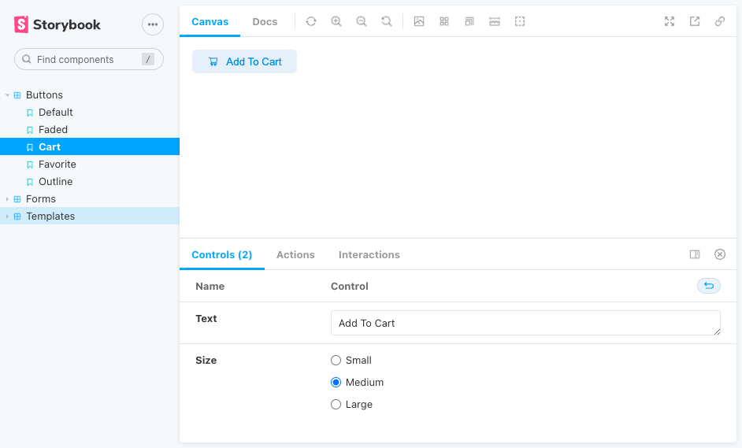

# Component-Library

### 

### [evrook.github.io/Component-Library](https://evrook.github.io/Component-Library/)

 

## Later Additions:
---
- More Components!

 

## Technologies Used:
---
 
 
 
 
 
 

 

 

## Acknowledgements:
---
- [Badges4](https://github.com/alexandresanlim/Badges4-README.md-Profile)
- [React Icons](https://react-icons.github.io/react-icons/)

 

## Contributions
---
- [Source Code](https://github.com/evRook/Component-Library)
- [Issue Tracker](https://github.com/evRook/Component-Library/issues)

